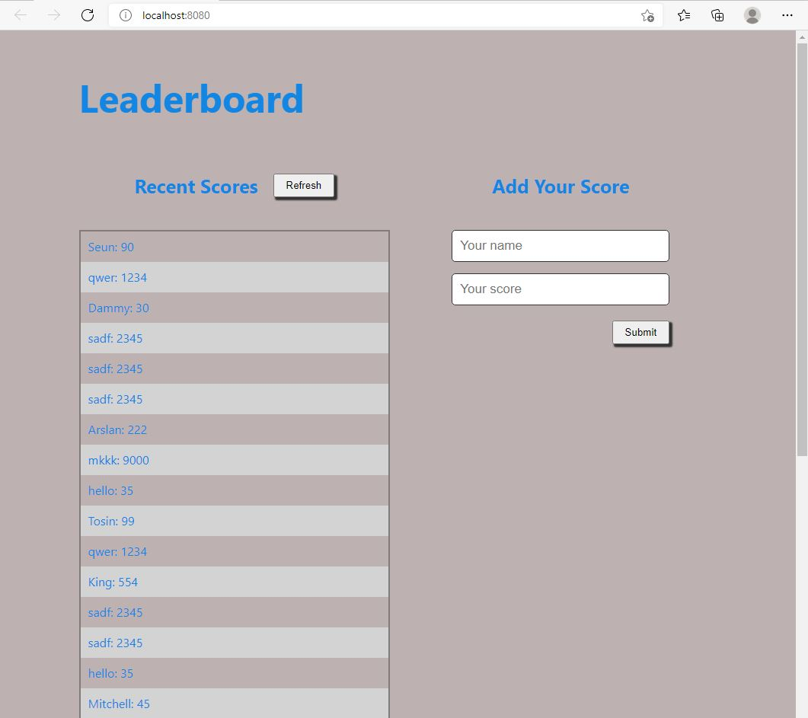

# Leaderboad

This is a leader board project that takes the scores of different players and sort the scores in an ascending order. This helps to determine the leader from all the scores at all times.
## Live Demo

[Live Demo Link](https://kossi-stack.github.io/Leaderboard/)

## Built With

- Html
- Css
- JavaScript
- Webpack

##  Prerequisites

- Text editor
- Git
- Html
- Css

## Getting Started

To get a local copy up and running follow these simple example steps.

- You can clone this repo by typing git clone `https://github.com/Kossi-stack/Leaderboard.git` on your terminal

- Type cd `Leaderboard` to access the project on the terminal

- Run `npm install` from your editor's terminal.

- Run `npm run build` from your editor's terminal.

- Run `npm start` from your editor's terminal to view the project in your browser.

## Author

👤 **Kossi-Stack**

- GitHub: [@githubhandle](https://github.com/Kossi-stack/Leaderboard)
- LinkedIn: [LinkedIn](https://www.linkedin.com/in/kossifioklou2406/)

## 🤝 Contributing

Contributions, issues, and feature requests are welcome!

Feel free to check the [issues page](https://github.com/Kossi-stack/Leaderboard/issues).

## Show your support

Give a ⭐️ if you like this project!

## 📝 License

This project is [MIT](./MIT.md) licensed.
